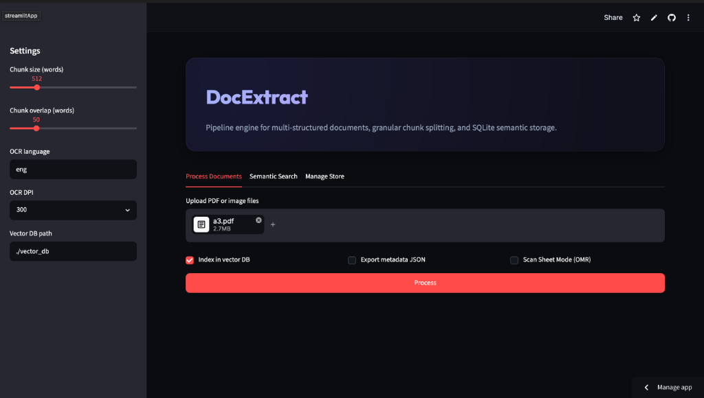

# Docextract

A python tool for extracting text and tables from PDFs and scanned documents, chunking the content, and indexing it into ChromaDB for semantic search. Includes a command-line tool and a Streamlit web interface.

[](https://docextract-arnav.streamlit.app)



## Features

- **Inline Document Preview**: Embeds a native browser PDF and image viewer directly into the dashboard so you can view files side-by-side with extraction logs.
- **Text & Table Extraction**: Extracts digital text and tables natively using `pdfplumber`. Falls back to OCR (`pytesseract` + `pdf2image`) if the page is scanned or image-based.
- **Image Preprocessing**: Uses OpenCV to deskew and align phone-scanned pages before running OCR.
- **Bubble Sheet Reader (OMR)**: Optional mode that grades bubble sheet inputs by tracking filled circle densities.
- **Paragraph Chunker**: Segments text into chunks by paragraph/sentence boundaries (with overlap) so context isn't lost.
- **Local Search**: Stores embeddings in a local ChromaDB instance (`all-MiniLM-L6-v2`) for offline semantic query.

## Project Structure

- `app.py` - Streamlit web app
- `main.py` - CLI commands
- `extractor.py` - Reads PDFs, runs OCR fallback
- `omr.py` - Image warping & bubble sheet detection
- `chunker.py` - Splits text into paragraph chunks
- `vector_store.py` - Database insert, search, and delete ops
- `pipeline.py` - Coordinates the whole workflow
- `models.py` - Pydantic schemas for docs and chunks

## Getting Started

### Install System Dependencies
- **Tesseract OCR**: Required for OCR fallback.
  - macOS: `brew install tesseract`
  - Linux: `sudo apt install tesseract-ocr`
- **Poppler**: Required for converting PDFs to images.
  - macOS: `brew install poppler`
  - Linux: `sudo apt install poppler-utils`

### Python Setup
Python 3.12 is recommended.
```bash
python3 -m venv venv
source venv/bin/activate
pip install -r requirements.txt
```

## How to Run

### Run the Web UI
```bash
streamlit run app.py
```

### Run CLI Commands
```bash
# Ingest a PDF file
python main.py process document.pdf

# List indexed documents
python main.py list

# Database stats
python main.py stats

# Search the database
python main.py search "compliance standards"
```

## Deployment

### Streamlit Community Cloud
1. Push this code to a public GitHub repository.
2. Go to [share.streamlit.io](https://share.streamlit.io/) and log in with GitHub.
3. Select your repository, set the main file to `app.py`, and click deploy.
